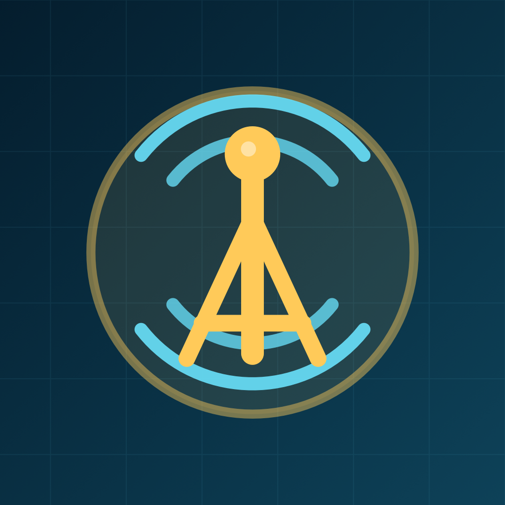

  
  <h1>HAM EXAMer</h1>
  
<strong>Your next call sign starts here.</strong>

  
A native iPhone study companion for your amateur radio license. Learn the material. Revisit the tough questions. Practice with confidence.

  
<a href="#meet-your-technician-study-companion">Explore the app</a> · <a href="#one-journey-three-license-levels">See what's next</a> · <a href="docs/BUILDING.md">Build for iOS</a>

---

## Meet your Technician study companion

Make the most of a spare moment, whether you are at home or away from a connection. HAM EXAMer brings the complete **2026–2030 Technician Class question pool** to your iPhone, with explanations, saved flashcards, and realistic mock exams.

The current iOS project includes the **Technician assistant**. **General** and **Amateur Extra** exam assistants are planned next.

## A little study. A stronger understanding.

### Learn the whole pool

Work through **409 questions across 35 groups**, including all three official diagrams. Answer a question, get immediate feedback, and read an explanation to understand the reasoning. Your place and progress are saved automatically.

### Keep the questions that need another look

Save questions to your flashcards and return to them for focused review. Build a personal study collection as you go.

### Put your preparation to the test

Take a timed **35-question mock exam**, with one question from each official group and shuffled answer choices. Answers stay hidden until submission. Review your results against the **26 out of 35** passing threshold, then revisit every question.

### Pick up wherever you left off

Study offline without an account. Learning progress, flashcards, and an unfinished mock exam stay on your device. Native Dynamic Type, VoiceOver labels, and light and dark appearances help you study comfortably.

## One journey. Three license levels.

Start with Technician. Keep learning as your radio ambitions grow.

| Assistant | What to expect | Project status |
| --- | --- | --- |
| **Technician · Element 2** | A complete question pool, explanations, flashcards, and mock exams for your first license. | **Included in this iOS project** |
| **General · Element 3** | A dedicated study assistant for your next license upgrade. | **Planned** |
| **Amateur Extra · Element 4** | A dedicated study assistant for the highest U.S. amateur radio license class. | **Planned** |

General and Amateur Extra are future releases; their question pools and exam modes are not included yet. Release dates will be announced when they are ready.

**Watch this repository for updates** using the Watch menu above, or **[share feedback and feature requests](https://github.com/graymongooseus/ham-examer/issues)**.

## Try the iOS project

The source is available here for local builds. Open `TechnicianRadio.xcodeproj` in Xcode, select an iPhone Simulator, and run the `TechnicianRadio` scheme. The app requires **iOS 17 or later**.

**[Build and verification guide →](docs/BUILDING.md)**

App Store and public TestFlight download links will be added when available.

## Built on the official questions

The bundled Technician pool is revised **February 19, 2026**, and covers **July 1, 2026 through June 30, 2030**. Official English questions and answer mappings are the source of truth. Explanations and optional translations are unofficial study aids.

- [NCVEC: 2026–2030 Technician question pool](https://ncvec.org/index.php/2026-2030-technician-question-pool)
- [ARRL: question pools and exam resources](https://www.arrl.org/question-pools)
- [ARRL: withdrawn questions](https://www.arrl.org/withdrawn-questions)

HAM EXAMer is independent study software, unaffiliated with the FCC, NCVEC, or ARRL. It helps you prepare; it does not administer licensing exams or issue licenses.

---

  
<strong>From your first question to your next license.</strong> Technician today. General and Amateur Extra on the roadmap.

